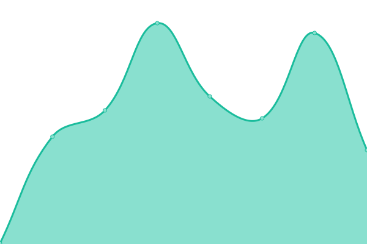
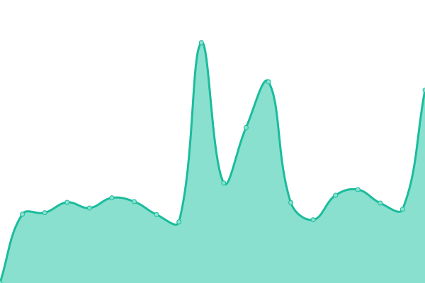

# [📈 Live Status](https://uptime.zinkhost.cloud): <!--live status--> **🟧 Partial outage**

This repository contains the open-source uptime monitor and status page for [S409ISDAD](https://uptime.zinkhost.cloud), powered by [Upptime](https://github.com/upptime/upptime).

With [Upptime](https://upptime.js.org), you can get your own unlimited and free uptime monitor and status page, powered entirely by a GitHub repository. We use [Issues](https://github.com/S409ISDAD/zink-uptime/issues) as incident reports, [Actions](https://github.com/S409ISDAD/zink-uptime/actions) as uptime monitors, and [Pages](https://uptime.zinkhost.cloud) for the status page.

<!--start: status pages-->
<!-- This summary is generated by Upptime (https://github.com/upptime/upptime) -->
<!-- Do not edit this manually, your changes will be overwritten -->
<!-- prettier-ignore -->
| URL | Status | History | Response Time | Uptime |
| --- | ------ | ------- | ------------- | ------ |
|  [Shard Jayden](https://zb.409409409.xyz) | 🟩 Up | [shard-jayden.yml](https://github.com/S409ISDAD/zink-uptime/commits/HEAD/history/shard-jayden.yml) | 

 385ms
     
 | 

<a href="https://uptime.zinkhost.cloud/history/shard-jayden">100.00%</a>
    

|  [Shard Daniel](https://zink-bot-production.onrender.com) | 🟩 Up | [shard-daniel.yml](https://github.com/S409ISDAD/zink-uptime/commits/HEAD/history/shard-daniel.yml) | 

 230ms
     
 | 

<a href="https://uptime.zinkhost.cloud/history/shard-daniel">100.00%</a>
    

|  [Shard Jack](https://zink-bot-porductution.onrender.com) | 🟥 Down | [shard-jack.yml](https://github.com/S409ISDAD/zink-uptime/commits/HEAD/history/shard-jack.yml) | 

 200ms
     
 | 

<a href="https://uptime.zinkhost.cloud/history/shard-jack">0.00%</a>
    

|  [Shard Ava](http://45.87.172.181:2898) | 🟩 Up | [shard-ava.yml](https://github.com/S409ISDAD/zink-uptime/commits/HEAD/history/shard-ava.yml) | 

 221ms
     
 | 

<a href="https://uptime.zinkhost.cloud/history/shard-ava">100.00%</a>
    

|  [Shard Robbie](http://dono-01.danbot.host:2047) | 🟩 Up | [shard-robbie.yml](https://github.com/S409ISDAD/zink-uptime/commits/HEAD/history/shard-robbie.yml) | 

 167ms
     
 | 

<a href="https://uptime.zinkhost.cloud/history/shard-robbie">78.63%</a>
    

|  [Shard Cole](http://deka.pylex.software:9886) | 🟩 Up | [shard-cole.yml](https://github.com/S409ISDAD/zink-uptime/commits/HEAD/history/shard-cole.yml) | 

 505ms
     
 | 

<a href="https://uptime.zinkhost.cloud/history/shard-cole">92.91%</a>
    

|  [Shard Sophia](http://192.99.10.133:6894) | 🟥 Down | [shard-sophia.yml](https://github.com/S409ISDAD/zink-uptime/commits/HEAD/history/shard-sophia.yml) | 

 43ms
     
 | 

<a href="https://uptime.zinkhost.cloud/history/shard-sophia">33.65%</a>
    

|  [Shard Jacob](https://zink-bot.onrender.com) | 🟩 Up | [shard-jacob.yml](https://github.com/S409ISDAD/zink-uptime/commits/HEAD/history/shard-jacob.yml) | 

 409ms
     
 | 

<a href="https://uptime.zinkhost.cloud/history/shard-jacob">99.72%</a>
    

|  [Shard Cameron](http://cameron.zinkhost.cloud:22565) | 🟩 Up | [shard-cameron.yml](https://github.com/S409ISDAD/zink-uptime/commits/HEAD/history/shard-cameron.yml) | 

 256ms
     
 | 

<a href="https://uptime.zinkhost.cloud/history/shard-cameron">76.48%</a>
    

|  [Shard Lewis](http://lewis.zinkhost.cloud:22565) | 🟩 Up | [shard-lewis.yml](https://github.com/S409ISDAD/zink-uptime/commits/HEAD/history/shard-lewis.yml) | 

 493ms
     
 | 

<a href="https://uptime.zinkhost.cloud/history/shard-lewis">51.28%</a>
    

|  [Shard Ethan](http://ethan.zinkhost.cloud:22565) | 🟩 Up | [shard-ethan.yml](https://github.com/S409ISDAD/zink-uptime/commits/HEAD/history/shard-ethan.yml) | 

 101ms
     
 | 

<a href="https://uptime.zinkhost.cloud/history/shard-ethan">60.44%</a>
    

|  [Shard Lucas](http://lucas.zinkhost.cloud:22565) | 🟩 Up | [shard-lucas.yml](https://github.com/S409ISDAD/zink-uptime/commits/HEAD/history/shard-lucas.yml) | 

 236ms
     
 | 

<a href="https://uptime.zinkhost.cloud/history/shard-lucas">78.38%</a>
    

<!--end: status pages-->

[**Visit our status website →**](https://uptime.zinkhost.cloud)

## 📄 License

- Powered by: [Upptime](https://github.com/upptime/upptime)
- Code: [MIT](./LICENSE) © [Anand Chowdhary](https://anandchowdhary.com), supported by [Pabio](https://pabio.com)
- Data in the `./history` directory: [Open Database License](https://opendatacommons.org/licenses/odbl/1-0/)
